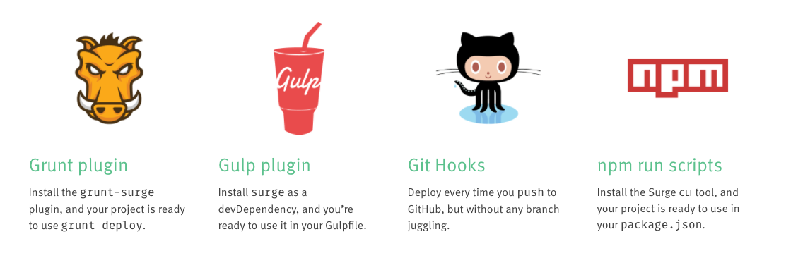

## Learn CSS Integration

Mock-up exercise to test HTML & CSS skills.
Re-create 3 interfaces based on 3 images. Make it look pixel perfect. Use only HTML & CSS (SCSS).

## View Exercises Online

- [Part 1](https://wisecoding.github.io/css-integration-mock-challenge/part1/part1.html)
- [Part 2](https://wisecoding.github.io/css-integration-mock-challenge/part2/part2.html)
- [Part 3](https://wisecoding.github.io/css-integration-mock-challenge/part3/part3.html)

### Interface 1

### Interface 2

### Interface 3

<b>Built with</b>

- [Visual Studio Code](https://code.visualstudio.com/)

## License

MIT License
MIT © 2020 [WiseCoding](https://github.com/WiseCoding/)
